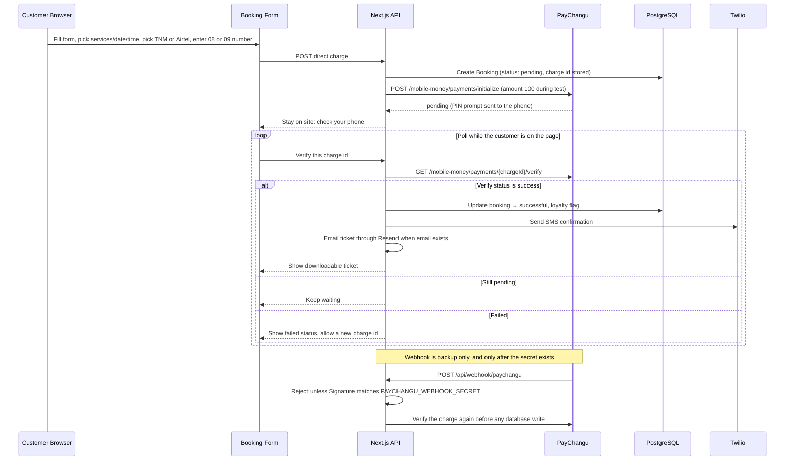

# Lauryn Luxe Beauty Studio — System Design Document

> **Generated via M.A.S.T.E.R. Framework Forensic Analysis**
> Version: **5** | Date: 2026-09-25 | Status: **Current**

## Changelog

| Version | Date | Summary |
|---------|------|---------|
| 5 | 2026-09-25 | Booking payment leaves PayChangu hosted checkout. The booking flow collects TNM Mpamba or Airtel Money on the site, starts a Direct Charge, and confirms only after PayChangu verify succeeds. That confirm writes the booking, shows the ticket, and emails it through Resend. The webhook stays a backup and does not confirm anything until its secret exists. The studio deposit stays K10,000. This integration test charges MWK 100. |
| 4 | 2026-09-25 | Phone inputs accept a Malawi local number or an international number that starts with `+`. Stored value is E.164. Malawi `08`/`09` forms still collapse to `+265` plus 9 digits. Other countries, such as `+256`, stay their own loyalty key. Names and junk are rejected on input. |
| 3 | 2026-09-25 | Loyalty, visits, and account phone checks use one Malawi number: `+265` plus 9 digits. Local `0`, bare `265`, `+265`, and spacing are the same phone. The 30% rule and the K10,000 PayChangu deposit are unchanged. |
| 2 | 2026-09-25 | Optional customer accounts via Neon Auth. Guests still book without an account. Signed-in customers skip name, phone, and email on the booking form, see upcoming and past visits for their phone, open the existing ticket, and reschedule under the existing once / 24-hour / no-payment rules. Loyalty stays keyed to the phone number; the account shows progress toward the next 30% visit. |
| 1 | 2026-02-11 | Current-state forensic baseline. |

---

## Table of Contents

1. [Model — Requirements Extraction](#1-model--requirements-extraction)
2. [Architecture — Detected System Structure](#2-architecture--detected-system-structure)
3. [Scale — Bottleneck & Capacity Analysis](#3-scale--bottleneck--capacity-analysis)
4. [Tradeoffs — Design Decision Registry](#4-tradeoffs--design-decision-registry)
5. [Execution — Transformation Strategy](#5-execution--transformation-strategy)
6. [Resilience — Failure Modes & Recovery](#6-resilience--failure-modes--recovery)
7. [Appendix — File Inventory & Data Models](#7-appendix--file-inventory--data-models)

---

## 1. Model — Requirements Extraction

### 1.1 System Purpose

Lauryn Luxe Beauty Studio is a **customer-facing beauty booking platform** for a nail studio in Blantyre, Malawi. It integrates appointment scheduling, payment processing (deposit-based), customer communications (SMS + email newsletter), and an admin dashboard — all within a single Next.js application.

### 1.2 Functional Requirements (Extracted from Code)

| ID | Requirement | Status | Source |
|----|-------------|--------|--------|
| FR-01 | **Booking Creation** — Customers create bookings by paying a non-refundable deposit with PayChangu Direct Charge. There is no hosted checkout page and no redirect. The booking is created `pending` when the charge is initialized and becomes `successful` only after PayChangu verify reports success. The studio deposit remains K10,000 MWK. While this integration is under test, the server charges MWK 100 and ignores any amount sent by the browser. | 🔲 Specified (v5) | Direct Charge, booking flow |
| FR-02 | **Payment Verification** — The page the customer is on polls the server, and the server calls PayChangu `GET /mobile-money/payments/{chargeId}/verify`. Success from that call is what updates the booking, shows the ticket, and sends the ticket email. The PayChangu webhook remains a backup: it must re-verify the same charge before it changes a booking, and it must reject the request when `PAYCHANGU_WEBHOOK_SECRET` is missing. An unsigned webhook never confirms a payment. | 🔲 Specified (v5) | Verify poll, webhook |
| FR-03 | **Loyalty Program** — Every 6th successful booking for one stored phone receives a 30% discount, stored as `discountApplied`. The stored phone is E.164 (`+` and digits only). A Malawi local number (`0999123456`, `999123456`, `265999123456`, `+265 999 123 456`, or `+2650999123456`) is stored as `+265` plus 9 digits and those forms count together. An international number is accepted only when it already starts with `+` and a country code, for example `+256772123456`, and it does not count with a Malawi number. PayChangu is charged the current deposit amount (MWK 100 during this test, K10,000 once the test amount is restored). The 30% is a studio flag, not a smaller charge. The flag is also sent to PayChangu as metadata. Verification counts the phone stored on the booking. | 🔲 Specified (v4) | Loyalty, checkout, verification |
| FR-04 | **Rescheduling** — Confirmed bookings can be rescheduled once, with 24-hour notice before appointment, no payment required. Conflict checking against existing bookings. | ✅ Implemented | `reschedule/route.ts` |
| FR-05 | **Booking Lookup** — Customers retrieve booking details via Ticket ID and initiate reschedule if eligible. | ✅ Implemented | `lookup/page.tsx` |
| FR-06 | **SMS Confirmation** — Twilio sends booking confirmation SMS with ticket ID, date, time, and services. The recipient is the stored E.164 phone from FR-03. | 🔲 Specified (v4) | `lib/sms.ts` |
| FR-07 | **Newsletter System** — Email subscription, unsubscription, and batch sending via Resend API with React email templates. | ✅ Implemented | `newsletter/*.ts` |
| FR-08 | **Service & Category Management** — CRUD for services and categories. Services linked to categories by name string. Category deletion blocked if services reference it. | ✅ Implemented (weak linking) | `services/route.ts`, `categories/route.ts` |
| FR-09 | **Date/Time Availability Management** — Admin can block specific time slots on specific dates. Fully booked dates are auto-detected and disabled in the calendar. | ✅ Implemented | `unavailable-dates/route.ts` |
| FR-10 | **Price List Management** — Upload price list images via Vercel Blob, URL stored in `SiteSettings`. | ✅ Implemented | `price-list/*.ts` |
| FR-11 | **Inspiration Photos** — Customers can upload up to 5 inspiration photos during booking, stored in Vercel Blob. | ✅ Implemented | `bookings/upload/route.ts` |
| FR-12 | **Admin Dashboard** — Unified panel for managing bookings, services, categories, availability, price list, and newsletters. Protected by static password. | ✅ Implemented (monolithic) | `admin/page.tsx` |
| FR-13 | **Payment Audit Trail** — All payment events logged to `PaymentEvent` table with sequential numbering per transaction. | ✅ Implemented | `lib/paymentLogger.ts` |
| FR-14 | **Ticket Download** — Confirmation page renders a ticket UI and allows PNG download via `html2canvas`. | ✅ Implemented | `booking/confirmation/page.tsx` |
| FR-15 | **Admin Manual Payment Verification** — Admin can manually verify a pending payment by transaction reference. | ✅ Implemented | `admin/verify-payment/route.ts` |
| FR-16 | **Optional customer account** — A customer may sign up and sign in with Neon Auth (email + password). Sign-in is optional. A guest with no session books exactly as today: same form, deposit, payment, ticket, lookup, and reschedule. | 🔲 Specified (v2) | Neon Auth |
| FR-17 | **Signup profile** — Signup collects name, email, password, and phone. Email is the Neon Auth login. Phone is required, stored as the E.164 value from FR-03, and unique on that value. Password is held by Neon Auth, not by the app database. The phone field rejects letters and any value that does not canonicalize. | 🔲 Specified (v4) | Customer profile |
| FR-18 | **Signed-in booking** — When a session exists, the booking form does not ask for name, phone, or email. Those values come from the profile and are written onto the booking the same way a guest would have typed them. Services, date, time, notes, and inspiration photos are unchanged. | 🔲 Specified (v2) | Booking form |
| FR-19 | **Account visits** — A signed-in customer has an account page with a **Visits** section: **Upcoming** and **Past**, listing successful bookings whose canonical phone equals the profile phone. No ticket-id search. Opening an upcoming visit shows the same downloadable ticket as `/booking/confirmation`. Past visits are appointments whose Blantyre date/time is already over. | 🔲 Specified (v3) | Account page |
| FR-20 | **Reschedule from a visit** — Reschedule started from an upcoming visit uses the existing rules (FR-04): once, at least 24 hours before the appointment, no extra payment, conflict check unchanged. The server accepts it only when that booking's phone is the session phone. | 🔲 Specified (v2) | Reschedule |
| FR-21 | **Loyalty progress** — The 30% rule is unchanged (FR-03): every 6th successful booking for that canonical phone. The account only displays progress from that count, for example "two visits until the 30% visit" when four successful bookings already exist (`6 - (count % 6)` visits remaining; `0` means the next booking is the discounted one). | 🔲 Specified (v3) | Account page |
| FR-22 | **On-site mobile money** — After the existing booking details, the customer picks TNM Mpamba or Airtel Money on the studio booking flow. TNM Mpamba accepts a Malawi number that starts with `08`. Airtel Money accepts a Malawi number that starts with `09`. That number is sent to PayChangu as the local mobile-money number. It does not replace the stored loyalty phone from FR-03. The operator id comes from PayChangu's operator list. The charge id is generated by the server, stored as `Booking` payment reference (`txRef` on `PaymentEvent`), and is new on every attempt. The screen stays on the site and tells the customer to approve the PIN prompt on their phone. The sample checkout screen in the Direct Charge guide is not used. | 🔲 Specified (v5) | Booking payment step |
| FR-23 | **Ticket email** — When verify marks a booking successful and that booking has an email, Resend sends the ticket details to that address. The on-screen ticket and PNG download stay. A failed email does not undo the successful booking, same as a failed SMS. | 🔲 Specified (v5) | Resend, confirmation |

### 1.3 Non-Functional Requirements (Inferred)

| ID | Requirement | Current State | Risk Level |
|----|-------------|---------------|------------|
| NFR-01 | **Authentication** — Admin access must be secured | Hardcoded password `'luxe'` in client code + env var check on admin API | 🔴 Critical |
| NFR-02 | **API Authorization** — Non-admin endpoints should be scoped | No auth middleware; all API routes are publicly accessible | 🔴 Critical |
| NFR-03 | **Data Integrity** — Referential integrity between services and categories | String-based linking (`Service.category` is `String`, not FK) | 🟡 Medium |
| NFR-04 | **Idempotency** — Payment processing must not create duplicate bookings | Webhook checks `booking.status !== 'successful'`; verify-payment has retry logic | 🟢 Adequate |
| NFR-05 | **Real-time Availability** — Booking form must reflect current slot availability | SWR polling at 1-second intervals for services, unavailable dates, and bookings | 🟡 Medium (aggressive) |
| NFR-06 | **Mobile Responsiveness** — Support both desktop and mobile users | Tailwind responsive classes used throughout; `useIsMobile` hook in admin | 🟢 Adequate |
| NFR-07 | **Build Safety** — Production builds should catch errors | ESLint and TypeScript checks disabled in `next.config.mjs` | 🟡 Medium |
| NFR-08 | **Customer session scope** — Visit lists, ticket open-from-account, and account reschedule must require a Neon Auth session and may return only bookings for that profile's phone. Guest booking, guest lookup by ticket id, payment, and webhook routes stay public. Admin auth is a separate control (NFR-01) and is not replaced by customer accounts. | 🔲 Specified (v2) | 🔴 Critical if missing |

---

## 2. Architecture — Detected System Structure

### 2.1 Architectural Style

**Monolithic Next.js Application** with:
- **Client-side rendering** for all interactive pages (`"use client"` throughout)
- **API Routes** as the sole backend (no separate API server)
- **No middleware layer** — each route handles its own validation/auth, except customer routes protected by the Neon Auth session (v2)
- **Direct Prisma calls** from API routes (no service/repository abstraction)
- **Neon Auth (Managed Better Auth)** for optional customer sign-up and sign-in (v2). Admin login stays the existing password check until that work is done separately.

### 2.2 Component Topology

```
┌─────────────────────────────────────────────────────────┐
│                    NEXT.JS APPLICATION                   │
│                                                          │
│  ┌──────────────────┐    ┌──────────────────────────┐   │
│  │   Pages (14)      │    │   API Routes (21)         │   │
│  │                   │    │                           │   │
│  │  / (homepage)     │    │  /api/bookings            │   │
│  │  /booking         │◄──►│  /api/paychangu/direct-charge │ │
│  │  /booking/confirm │    │  /api/verify-payment      │   │
│  │                   │    │  /api/webhook/paychangu   │   │
│  │  /booking/status  │    │  /api/reschedule          │   │
│  │  /lookup          │    │  /api/services            │   │
│  │  /reschedule      │    │  /api/categories          │   │
│  │  /services        │    │  /api/newsletter/*        │   │
│  │  /admin           │    │  /api/unavailable-dates   │   │
│  │  /about           │    │  /api/price-list/*        │   │
│  │  /contact         │    │  /api/payment-events      │   │
│  │  /prices          │    │  /api/admin/verify-payment│   │
│  │  /policies        │    │  /api/callback (stub)     │   │
│  │  /unsubscribed    │    │  /api/bookings/upload     │   │
│  │  /sign-in (v2)    │    │  /api/auth/[...path] (v2) │   │
│  │  /sign-up (v2)    │    │  /api/account/visits (v2) │   │
│  │  /account (v2)    │    │                           │   │
│  └──────────────────┘    └──────────┬───────────────┘   │
│                                      │                   │
│  ┌──────────────────┐    ┌──────────▼───────────────┐   │
│  │   Lib Modules (5) │    │   Prisma ORM              │   │
│  │                   │    │   (7 models)              │   │
│  │  prisma.ts        │    │                           │   │
│  │  sms.ts           │    │  Booking                  │   │
│  │  paymentLogger.ts │    │  PaymentEvent             │   │
│  │  time-slots.ts    │    │  Service                  │   │
│  │  utils.ts         │    │  Category                 │   │
│  └──────────────────┘    │  UnavailableDate          │   │
│                           │  NewsletterSubscription   │   │
│                           │  SiteSettings             │   │
│                           └──────────┬───────────────┘   │
└──────────────────────────────────────┼───────────────────┘
                                       │
                          ┌────────────▼────────────┐
                          │   Neon PostgreSQL (Cloud) │
                          └─────────────────────────┘

          External Services:
          ┌─────────────┐  ┌──────────┐  ┌──────────────┐
          │  PayChangu   │  │  Twilio   │  │  Resend      │
          │  (Payments)  │  │  (SMS)    │  │  (Email)     │
          └─────────────┘  └──────────┘  └──────────────┘
          ┌──────────────────────────────────────────────┐
          │  Neon Auth (v2) — customer email/password    │
          │  Sessions in neon_auth; app stores profile   │
          └──────────────────────────────────────────────┘
                                          ┌──────────────┐
                                          │  Vercel Blob  │
                                          │  (File Store) │
                                          └──────────────┘
```

### 2.3 Data Model (Prisma Schema)

```
┌───────────────┐     ┌───────────────────┐
│   Category    │     │     Service       │
│───────────────│     │───────────────────│
│ id (PK)       │     │ id (PK)           │
│ name (unique) │◄╌╌╌╌│ category (String) │  ← Weak link (no FK)
│ slug (unique) │     │ name              │
│ description?  │     │ description?      │
│ imageUrl?     │     │ duration          │
└───────────────┘     │ isAvailable       │
                      └───────────────────┘

┌────────────────────┐     ┌───────────────────┐
│     Booking        │     │   PaymentEvent    │
│────────────────────│     │───────────────────│
│ id (PK)            │     │ id (PK)           │
│ name               │     │ txRef             │
│ phone              │     │ eventType         │
│ email?             │     │ status            │
│ date               │     │ payload (JSON)    │
│ timeSlot           │     │ sequence          │
│ services (String[])│     └───────────────────┘
│ notes?             │
│ ticketId (unique)  │     ┌───────────────────┐
│ status             │     │  UnavailableDate  │
│ discountApplied    │     │───────────────────│
│ inspirationPhotos[]│     │ id (PK)           │
│ rescheduleCount    │     │ date (unique)     │
│ originalDate?      │     │ timeSlots (String[])│
└────────────────────┘     └───────────────────┘

┌──────────────────────────┐    ┌───────────────┐
│ NewsletterSubscription   │    │ SiteSettings  │
│──────────────────────────│    │───────────────│
│ id (PK)                  │    │ id (PK)       │
│ email (unique)           │    │ key (unique)  │
│ createdAt                │    │ value         │
└──────────────────────────┘    └───────────────┘

┌──────────────────────────┐
│ CustomerProfile (v2)     │
│──────────────────────────│
│ id (PK)                  │
│ neonUserId (unique)      │  ← Neon Auth user id
│ name                     │
│ email (unique)           │
│ phone (unique)           │  ← E.164; Malawi local forms become +265 plus 9 digits
│ createdAt                │
└──────────────────────────┘

Bookings are not given a user foreign key. Visits and loyalty both select `Booking` rows by the canonical phone from FR-03. Existing rows written as another form of that same number are included, and a one-time rewrite stores the canonical value on `Booking` and `CustomerProfile`. Two profiles that collapse to one number are not merged. The customer cannot edit the profile phone, because a change would split that history. A genuinely different number stays a different customer.
```

### 2.4 Critical Flow: Booking + Payment Sequence



Signed-in booking uses this same sequence. The only difference is that name, phone, and email are taken from `CustomerProfile` instead of form fields. The mobile-money number on the payment step is still entered for the selected operator. Guest and signed-in booking store the canonical phone from FR-03. Loyalty counts successful bookings by the phone stored on the booking. Hosted checkout (`checkout_url`, return redirect, and the PayChangu public key) is removed from this flow.

### 2.5 Page Routing Map

| Route | Type | Purpose | Auth |
|-------|------|---------|------|
| `/` | Public | Landing page with hero, services preview, newsletter signup | None |
| `/booking` | Public | Multi-step booking form, on-site mobile money, and in-page verify | None |
| `/booking/verifying` | Public | Legacy redirect target. Direct Charge does not send the customer here. | None |
| `/booking/confirmation` | Public | Ticket display + download | None |
| `/booking/status` | Public | Failed/cancelled payment status page | None |
| `/lookup` | Public | Booking lookup by Ticket ID + reschedule | None |
| `/reschedule` | Public | Standalone reschedule form (legacy) | None |
| `/services` | Public | Service catalog grouped by category | None |
| `/about` | Public | Studio & founder information | None |
| `/contact` | Public | Contact information | None |
| `/prices` | Public | Price list image display | None |
| `/policies` | Public | Studio policies | None |
| `/unsubscribed` | Public | Newsletter unsubscribe confirmation | None |
| `/admin` | "Protected" | Full admin dashboard | Hardcoded password |
| `/sign-in` | Public | Email + password sign-in (Neon Auth) | None to view; creates a customer session |
| `/sign-up` | Public | Name, email, password, and phone | None to view; creates Neon Auth user + CustomerProfile |
| `/account` | Customer | Visits (upcoming and past) and loyalty progress | Neon Auth session |

---

## 3. Scale — Bottleneck & Capacity Analysis

### 3.1 Current Scale Profile

| Dimension | Current State | Concern |
|-----------|---------------|---------|
| **User Volume** | Single-operator beauty studio (~20 bookings/week estimated) | Low volume, current architecture sufficient |
| **Database** | Neon PostgreSQL (serverless) | Auto-scales, but no connection pooling configured |
| **API Calls/Page** | Booking page: 3 SWR endpoints × 1s polling = ~180 req/min from a single open tab | ⚠️ Excessive |
| **External API Budget** | Twilio SMS (~$0.01/msg), Resend (free tier), PayChangu (per-transaction) | Manageable at current scale |
| **File Storage** | Vercel Blob (inspiration photos + price list) | No upload size limits enforced in code |

### 3.2 Identified Bottlenecks

#### B-01: Aggressive SWR Polling

**Files affected:** `booking/page.tsx`, `booking-form.tsx`, `services/page.tsx`

| Endpoint | `refreshInterval` | Issue |
|----------|--------------------|-------|
| `/api/services` | 1000ms (booking-form) | Fetches all services every second |
| `/api/unavailable-dates` | 1000ms | Fetches all unavailable dates every second |
| `/api/bookings?status=successful` | 1000ms | Fetches ALL successful bookings every second |
| `/api/services` | 2000ms (services page) | Less aggressive but still high |

**Impact:** With 5 concurrent users on the booking page, the server handles ~15 requests/second just for availability polling. Each request queries the full database table with no pagination or caching.

**Recommendation:** Replace 1s polling with:
- Server-Sent Events (SSE) for real-time updates, or
- 30-second polling with optimistic UI updates, or
- On-demand refresh (fetch only when date changes)

#### B-02: No Pagination on Booking Queries

The admin dashboard fetches ALL bookings on load. The booking page fetches ALL successful bookings for slot calculation. As the booking table grows (hundreds → thousands), these queries will degrade.

#### B-03: Monolithic Admin Component

`admin/page.tsx` is **1,597 lines** with **30+ useState hooks** managing bookings, services, categories, availability, price list, and newsletter — all in a single React component. This creates:
- Excessive re-renders (any state change re-renders everything)
- Difficult to maintain and test
- No code splitting possible

### 3.3 Time Slot Capacity Model

| Day | Available Slots | Max Bookings/Day |
|-----|----------------|-------------------|
| Mon-Thu | 4 (08:30, 10:30, 13:00, 15:00) | 4 |
| Friday | 3 (08:30, 10:30, 13:00) | 3 |
| Saturday | 3 (10:00, 12:00, 14:00) | 3 |
| Sunday | 0 | Closed |

**Weekly maximum capacity:** 22 bookings/week

---

## 4. Tradeoffs — Design Decision Registry

### 4.1 Decisions Made (Current State)

| ID | Decision | Rationale (Inferred) | Consequence |
|----|----------|---------------------|-------------|
| TD-01 | **All pages are client-rendered** (`"use client"`) | Simplicity; avoid RSC complexity | No SSR/SEO benefits; larger JS bundles; all data fetching happens client-side |
| TD-02 | **No service/repository layer** — API routes call Prisma directly | Speed of development | Business logic scattered across routes; loyalty logic duplicated in 2 places |
| TD-03 | **Service-Category link via string** instead of FK | Avoid Prisma relation complexity | Orphaned references possible; no cascade behavior; integrity depends on application-level checks |
| TD-04 | **Hardcoded admin password** in client bundle | MVP speed | Anyone can inspect source and retrieve password; no session management |
| TD-05 | **Payment deposit hardcoded** at K10,000 | Fixed pricing model | Cannot adjust without code change; no admin UI for deposit amount |
| TD-06 | **sessionStorage for page-to-page state transfer** | Avoid server-side sessions | State lost on browser restart; fragile — depends on exact navigation flow |
| TD-07 | **Disabled ESLint and TypeScript checks** in production builds | Bypass build errors | Type errors and linting issues ship to production undetected |
| TD-08 | **Dual verification: polling + webhook** | Redundancy for payment reliability | Good pattern, but loyalty logic is duplicated between both paths. [SUPERSEDED BY TD-12] |
| TD-12 | **Direct Charge on the studio booking flow** (v5) | Hosted checkout's redirect can show a wrong result after a real debit. The site collects TNM Mpamba (`08`) or Airtel Money (`09`), initializes the charge, and trusts only a later verify call. The guide's sample checkout UI is not used. The webhook cannot confirm a booking until its secret is set. MWK 100 is the test charge only; the studio deposit stays K10,000. | The customer must stay for the PIN prompt. A closed tab leaves the booking `pending` until a later verify or a signed webhook runs the same confirm path. |
| TD-09 | **1-second SWR polling** for real-time availability | Ensure users see up-to-date slots | Excessive server load; unnecessary for a low-volume studio |
| TD-10 | **Single admin page (1,597 lines)** | All management in one place | Unmaintainable; no lazy loading; full re-render on any state change |
| TD-11 | **Optional Neon Auth; E.164 phone remains the customer key** (v4) | Guests must keep booking with no account. Loyalty and tickets are stored by phone, not by user id. Malawi local forms collapse to `+265` plus 9 digits. Any other country is stored only when typed with `+` and its country code, and stays a separate customer. | Email/password live in Neon Auth. The app stores name, email, and the E.164 phone on `CustomerProfile`. Visits match that phone. One stored phone, one account. The customer cannot edit it. Guest ticket lookup stays. Two profiles that canonicalize to one number are not merged. |

### 4.2 Missing Decisions (Gaps)

| ID | Missing Decision | Impact |
|----|-----------------|--------|
| MG-01 | **No cancellation policy** — No way for customers to cancel a booking | Permanently pending bookings if payment fails; no refund flow |
| MG-02 | **No booking duration/overlap detection** — Multiple bookings can be made for the same slot | Only 1 booking per slot per day enforced, but no duration-based overlap checking |
| MG-03 | **No rate limiting** on API routes | Vulnerable to abuse (booking spam, SMS flooding) |
| MG-04 | **No CORS configuration** | API routes accessible from any origin |
| MG-05 | **No input sanitization/validation middleware** | Each route does its own ad-hoc validation |
| MG-06 | **No error monitoring** (Sentry, LogRocket, etc.) | Errors may go undetected in production |

---

## 5. Execution — Transformation Strategy

### 5.1 Priority Matrix

Issues are ranked by **severity × effort** to produce a recommended execution order.

| Priority | Issue | Severity | Effort | Phase |
|----------|-------|----------|--------|-------|
| 🔴 P0 | Bug #1: Incorrect Friday slots (Slot Leak) | Critical | Low | 0 |
| 🔴 P0 | Bug #3: Admin cannot see pending bookings | Critical | Low | 0 |
| 🔴 P0 | Hardcoded admin password in client bundle (TD-04) | Critical | Low | 1 |
| 🔴 P0 | No API route authorization (NFR-02) | Critical | Medium | 1 |
| 🟠 P1 | Bug #2: Price list upload failures | High | Low | 0 |
| 🟠 P1 | Bug #4: Poor PayChangu recovery UI | High | Medium | 0 |
| 🟠 P1 | Duplicated loyalty logic (FR-03) | High | Low | 1 |
| 🟠 P1 | Re-enable ESLint/TypeScript checks (TD-07) | High | Medium | 1 |
| 🟡 P2 | Add FK relation: Service → Category (TD-03) | Medium | Medium | 2 |
| 🟡 P2 | Reduce SWR polling frequency (B-01) | Medium | Low | 2 |
| 🟡 P2 | Make deposit amount configurable (TD-05) | Medium | Low | 2 |
| 🟡 P2 | Complete callback route stub | Medium | Low | 2 |
| 🟢 P3 | Decompose monolithic admin page (B-03) | Medium | High | 3 |
| 🟢 P3 | Add pagination to booking queries (B-02) | Medium | Medium | 3 |
| 🟢 P3 | Add API rate limiting (MG-03) | Low | Medium | 3 |
| 🟢 P3 | Add error monitoring (MG-06) | Low | Medium | 3 |

### 5.2 Phase 0: Production Hotfixes (Current)

#### 5.2.1 Fix Friday 3PM Slot
- **Issue:** Timezone-sensitive day detection in `lib/time-slots.ts`.
- **Target:** Fix `getDay()` logic to be UTC-safe and add server-side slot validation in the checkout API.

#### 5.2.2 Fix Admin Pending Bookings
- **Issue:** Default status filter hides actionable pending bookings.
- **Target:** Change default admin filter to `'all'`.

#### 5.2.3 Fix Price List Upload
- **Issue:** No size limits + silent failures.
- **Target:** Add 4.5MB client-side limit and improve error feedback.

#### 5.2.4 Improve PayChangu Recovery
- **Issue:** User stuck after payment failure despite possible debit.
- **Target:** Add "Verification Delayed" UI with Ticket ID and contact info.

### 5.3 Phase 1: Security & Correctness (1-2 days)

#### 5.2.1 Fix Admin Authentication

**Current:** Password `'luxe'` hardcoded at line 54 of `admin/page.tsx`. Server-side admin routes use `ADMIN_PASSWORD` env var.

**Target:**
- Remove hardcoded password from client code
- Implement NextAuth.js or a simple JWT-based auth flow
- Add auth middleware for all `/api/admin/*` routes
- Replace `sessionStorage` auth with HTTP-only cookies

#### 5.2.2 Extract Shared Business Logic

**Current:** Loyalty discount calculation is duplicated in:
1. `verify-payment/route.ts` (lines 138-181)
2. `webhook/paychangu/route.ts` (lines 111-155)

**Target:**
```
lib/
├── loyalty.ts        ← Extract: calculateLoyaltyDiscount(phone)
├── booking-service.ts ← Extract: confirmBooking(bookingId, txRef)
└── sms.ts            ← Already extracted
```

#### 5.2.3 Re-enable Build Checks

**Current:** `next.config.mjs` sets `ignoreBuildErrors: true` for both ESLint and TypeScript.

**Target:** Enable both, fix all surfaced errors.

### 5.3 Phase 2: Data Integrity & Performance (2-3 days)

#### 5.3.1 Add Service → Category FK

**Current:** `Service.category` is a plain `String`.

**Target Prisma Schema:**
```prisma
model Service {
  id          String    @id @default(cuid())
  name        String
  description String?
  duration    Int
  categoryId  String
  category    Category  @relation(fields: [categoryId], references: [id])
  isAvailable Boolean   @default(true)
  createdAt   DateTime  @default(now())
  updatedAt   DateTime  @updatedAt
}

model Category {
  id          String    @id @default(cuid())
  name        String    @unique
  slug        String    @unique
  description String?
  imageUrl    String?
  services    Service[]
  createdAt   DateTime  @default(now())
  updatedAt   DateTime  @updatedAt
}
```

**Migration:** Write a migration script that maps existing `Service.category` string values to `Category.id` values.

#### 5.3.2 Reduce SWR Polling

| Endpoint | Current | Target |
|----------|---------|--------|
| `/api/services` | 1000ms | `revalidateOnFocus` only (0) |
| `/api/unavailable-dates` | 1000ms | 30000ms or on-demand |
| `/api/bookings?status=successful` | 1000ms | 30000ms or on-demand |

#### 5.3.3 Make Deposit Configurable

Move the hardcoded `10000` to `SiteSettings` with key `'deposit_amount'`, fetched at checkout time.

### 5.4 Phase 3: Maintainability (3-5 days)

#### 5.4.1 Decompose Admin Page

Split `admin/page.tsx` (1,597 lines) into:

```
app/admin/
├── page.tsx              ← Shell with tabs/navigation
├── components/
│   ├── BookingsPanel.tsx  ← Booking management
│   ├── ServicesPanel.tsx  ← Service CRUD
│   ├── CategoriesPanel.tsx ← Category CRUD
│   ├── AvailabilityPanel.tsx ← Date/slot management
│   ├── NewsletterPanel.tsx ← Newsletter management
│   └── PriceListPanel.tsx ← Price list upload
└── hooks/
    └── useAdminData.ts   ← Shared data fetching
```

#### 5.4.2 Add Pagination

Add cursor-based pagination to `GET /api/bookings` with `take`, `skip`, and `cursor` parameters.

### 5.5 Customer accounts (SDD v2)

Not part of the forensic hotfix phases above. Implement optional Neon Auth sign-up and sign-in, a `CustomerProfile` keyed by phone, a signed-in booking path that skips name/phone/email, and an account Visits page (upcoming, past, existing ticket, existing reschedule rules, loyalty progress). Guest booking is unchanged. Admin authentication stays on the existing password until its own security work.

### 5.6 Stored phone and input check (SDD v4)

Loyalty, visits, signup uniqueness, and account reschedule compare one stored phone: `+` followed by digits only, at most 15 digits.

Malawi entry, with or without spaces, dashes, or brackets: leading `0` plus 9 digits, 9 digits alone, `265` plus 9 digits, or `+265` plus 9 digits. `+265` followed by an extra `0` and then 9 digits drops that `0`. All of these save as `+265` plus 9 digits. A leading letter `O` used in place of `0` on an otherwise numeric Malawi number is treated as `0`.

International entry must already start with `+` and a country code, for example `+256772123456` or `+44 7471 224556`. Strip spaces, dashes, and brackets, then save `+` plus the digits. Do not invent a country code. `07740971277` is not rewritten to `+44`.

The booking, signup, and admin phone boxes accept only characters that can become one of those forms, and they refuse submit until the value canonicalizes. The server applies the same rule and rejects names and other junk. Rewrite existing `Booking.phone` values that canonicalize, including international numbers that already start with `+`. Leave names, junk, and country-less non-Malawi numbers unchanged. `CustomerProfile` has no rows yet. If two profiles ever collapse to one number, stop and report them; do not merge the accounts. SMS uses the stored value. The 30% rule stays as it is. The studio deposit stays K10,000; the Direct Charge test in section 5.7 charges MWK 100 until that test amount is restored.

### 5.7 Direct Charge instead of hosted checkout (SDD v5)

Remove PayChangu hosted checkout from booking. Keep the existing `Booking` and `PaymentEvent` models. Do not add the guide's `Order` / `Payment` models, and do not build the guide's sample checkout screen.

On the booking payment step the customer chooses TNM Mpamba or Airtel Money and enters the payer number (`08…` or `09…`). The server creates a pending booking, generates a new charge id, and calls `POST /mobile-money/payments/initialize` for MWK 100. The browser never leaves the site. It polls until verify returns success, failed, or the customer retries with a new charge id.

One shared confirm path, used by the poll and later by the webhook, marks the booking successful, applies loyalty, sends the SMS, emails the ticket through Resend when `email` is present, and returns the ticket for display and PNG download. If `PAYCHANGU_WEBHOOK_SECRET` is unset, the webhook returns 401 and writes nothing. `PAYCHANGU_PUBLIC_KEY` is not used. Restore the charged amount to K10,000 before this flow is used for real deposits.

---

## 6. Resilience — Failure Modes & Recovery

### 6.1 Failure Mode Analysis

| ID | Failure Mode | Current Handling | Risk |
|----|-------------|------------------|------|
| FM-01 | **PayChangu API down** during charge initialize | API returns the PayChangu message; user stays on the booking payment step and can retry with a new charge id | 🟡 User must retry manually |
| FM-02 | **PIN succeeds but the page never sees verify success** | The booking stays `pending`. A later verify of the same charge id, or a signed webhook that re-verifies, runs the same confirm path once. Until the webhook secret exists, only the verify poll can confirm. | 🟡 A closed tab is not recovered until something calls verify again |
| FM-03 | **Twilio SMS fails** | SMS send is fire-and-forget; booking still succeeds | 🟢 Acceptable — SMS is informational |
| FM-04 | **Database connection drops** | Prisma will throw; API returns 500 | 🟡 No circuit breaker; no retry |
| FM-05 | **sessionStorage cleared** between booking and verification | Verification page shows error "booking data not found" | 🟡 User must rebook — no recovery from persistent store |
| FM-06 | **Webhook signature mismatch** | Returns 401; booking stuck in `pending` | 🟡 Admin can manually verify, but no automated alerting |
| FM-07 | **Admin password leaked** | Full admin access to anyone | 🔴 No password rotation; no 2FA; no audit log for admin actions |
| FM-08 | **Concurrent booking for same slot** | No database-level unique constraint on `(date, timeSlot)`; only checked via SWR poll | 🟡 Race condition possible |
| FM-09 | **Neon Auth unavailable** (v2) | Guest booking, payment, lookup, and reschedule must not call Neon Auth. Only sign-in, sign-up, and `/account` depend on it. | 🟢 Guest path stays bookable |
| FM-10 | **Phone cannot be stored as E.164** (v4) | The phone box and the server reject it before save. A stored value that cannot be canonicalized is left unchanged and reported by the rewrite. | 🟢 Names and junk do not become a loyalty identity |

### 6.2 Recovery Recommendations

| FM | Recommendation | Effort |
|----|---------------|--------|
| FM-05 | Persist booking form data server-side (part of the `Booking` record with `pending` status — already done!) and retrieve from DB on verification page using `tx_ref`. Remove sessionStorage dependency. | Low |
| FM-07 | Implement proper auth (see Phase 1). Add admin action audit logging. | Medium |
| FM-08 | Add unique constraint: `@@unique([date, timeSlot])` on `Booking` model (for successful bookings). Use database transaction with conflict check in checkout route. | Low |
| FM-04 | Add Prisma retry middleware and connection pool configuration for Neon. | Low |

### 6.3 Payment Logger Coverage

The `PaymentEvent` table provides excellent audit coverage. Events logged:

| Stage | Event Types |
|-------|-------------|
| Direct Charge | `charge_initiated`, `booking_created`, `paychangu_initialize`, `awaiting_pin` |
| Verification | `verification_started`, `paychangu_verify_response`, `booking_updated`, `sms_sent`, `ticket_email_sent` |
| Webhook | `webhook_received`, `signature_verified`, `booking_confirmed` |
| Admin | `admin_verify_started`, `admin_verify_result` |

---

## 7. Appendix — File Inventory & Data Models

### 7.1 Technology Stack

| Layer | Technology | Version |
|-------|-----------|---------|
| Framework | Next.js | 15.2.8 |
| Language | TypeScript | 5.x |
| UI Library | React | 19.x |
| Styling | Tailwind CSS | 3.x |
| UI Primitives | Radix UI | Various |
| Animations | Framer Motion | Latest |
| ORM | Prisma | 6.10.1 |
| Database | Neon PostgreSQL | Serverless |
| Payments | PayChangu API | v1 |
| SMS | Twilio | Latest |
| Email | Resend | Latest |
| File Storage | Vercel Blob | Latest |
| Deployment | Vercel | Serverless |
| Data Fetching | SWR | Latest |
| Forms | React Hook Form + Zod | Latest |
| Customer auth | Neon Auth (`@neondatabase/auth`, Managed Better Auth) | Current SDK |

### 7.2 File Count Summary

| Directory | Files | Total Lines (approx) |
|-----------|-------|---------------------|
| `app/api/` | 21 route files | ~2,200 |
| `app/` (pages) | 14 page files | ~3,600 |
| `components/` | ~30 component files | ~4,000 |
| `lib/` | 5 utility files | ~170 |
| `prisma/` | Schema + seed | ~200 |
| `types/` | 1 type file | ~30 |
| **Total** | **~75 source files** | **~10,200** |

### 7.3 Environment Variables

| Variable | Purpose | Security Level |
|----------|---------|---------------|
| `DATABASE_URL` | Neon PostgreSQL connection string | 🔴 Secret |
| `RESEND_API_KEY` | Newsletter and booking ticket email | 🔴 Secret |
| `TWILIO_ACCOUNT_SID` | Twilio account identifier | 🔴 Secret |
| `TWILIO_AUTH_TOKEN` | Twilio authentication token | 🔴 Secret |
| `TWILIO_PHONE_NUMBER` | SMS sender phone number | 🟡 Semi-public |
| `PAYCHANGU_SECRET_KEY` | Direct Charge initialize and verify | 🔴 Secret |
| `PAYCHANGU_WEBHOOK_SECRET` | Webhook signature. Absent until provided; webhook must not confirm without it | 🔴 Secret |
| `ADMIN_PASSWORD` | Admin dashboard access | 🔴 Secret (also hardcoded in client!) |
| `NEXT_PUBLIC_SITE_URL` | Frontend URL | 🟢 Public |
| `BLOB_READ_WRITE_TOKEN` | Vercel Blob file operations | 🔴 Secret |
| `NEON_AUTH_BASE_URL` | Neon Auth server URL (v2) | 🟡 Semi-public |
| `NEON_AUTH_COOKIE_SECRET` | Signed HTTP-only customer session cookie (v2) | 🔴 Secret |

### 7.4 Business Hours vs Code

| Source | Mon-Thu | Friday | Saturday | Sunday |
|--------|---------|--------|----------|--------|
| Homepage UI | 10:00 AM - 6:00 PM | 10:00 AM - 6:00 PM | 10:00 AM - 4:00 PM | Closed |
| Booking Form UI | 8:30 - 16:30 | 8:30 - 15:00 | 10:00 - 15:00 | Closed |
| `time-slots.ts` Code | 08:30, 10:30, 13:00, 15:00 | 08:30, 10:30, 13:00 | 10:00, 12:00, 14:00 | [] |

> [!WARNING]
> **Business hours are inconsistent** between the homepage (10 AM - 6 PM Mon-Fri) and the booking form/code (8:30 AM - 4:30 PM Mon-Thu, 8:30 AM - 3:00 PM Fri). The actual slot times in code are the authoritative source.

---

> **End of Document**
> This SDD serves as the canonical architectural reference for all future refactoring tasks on the Lauryn Luxe Beauty Studio codebase.
